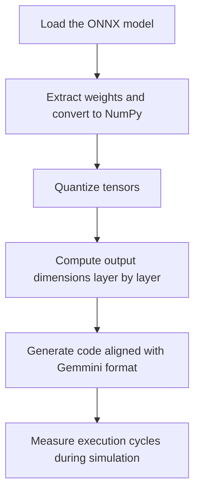

# Onnx2gemmini

A utility to convert **ONNX** models into **C and H files compatible with Gemmini**, enabling cycle-accurate simulation of neural networks on the Gemmini accelerator within the **Chipyard / FireSim** ecosystem.

This script automates the generation of code required to evaluate quantized CNNs and MLPs on Gemmini, facilitating research and development of experiments in the context of RISC-V accelerators.

## Features

- Supports ONNX layers: Convolution (Conv), Fully Connected (Gemm), Pooling (MaxPool / AveragePool), ReLU (automatic fusion), Flatten, Add, and other non-computational layers (automatic buffer propagation).  
- Automatic quantization (8 or 16 bits) with scale and shift calculation.  
- Generates:  
  - **C file** containing Gemmini execution setup, calls to `tiled_conv_auto` and `tiled_matmul_nn_auto`, and cycle counting (conv × matmul).  
  - **Header file** containing quantized weights and biases, input and output buffers, and parameter structs (`ConvParams` and `FcParams`).  
- Compatible with baremetal or Linux execution.  
- Conv + ReLU + Pool fusion automatically handled.

## Output File Structure

After conversion, the specified output directory (`--out`) will contain:
<basename>.c # Main code for Gemmini execution
<basename>_params.h # Quantized weights, biases, and network parameters


## How to Use

### Requirements
Create the conda onnx2gemmini enviroment with:

```shell
conda env create -f environment.yml
```

To activate, use:
```shell
conda activate onnx2gemmini
```

### Execution Example
`python3 onnx2gemmini.py model.onnx --out build --precision 8 --batch_size 4`

### Arguments

| Flag | Description | Default |
|------|-------------|---------|
| `onnx` | Path to ONNX model (required) | — |
| `--out` | Output directory | `out` |
| `--precision` | Quantization: 8 or 16 bits | `8` |
| `--batch_size` | Batch size for execution | `4` |

## Complete Example
`python3 onnx2gemmini.py resnet50.onnx --out resnet50_gemmini --precision 8 --batch_size 1`

This will generate:

```
resnet50_gemmini/
├─ resnet50_gemmini.c
├─ resnet50_gemmini_params.h
```


Ready to be included in a Chipyard project, replacing the default `resnet50` example.

## Internal Workflow



## 🔍 Current Limitations

- Partial support for very deep networks with non-linear architectures (multiple branches)  
- Does not support layers: Softmax, BatchNorm (requires prior fusion), Upsampling  
- ONNX models must include embedded weights (`initializer`)  

> For unsupported operations, the script tries to propagate buffers to continue execution.

## Roadmap

- Automatic Conv + ReLU + Pool fusion (implemented)  
- Per-channel quantization support (planned)  
- Support for networks with branches (e.g., ResNet skip connections, planned)  
- Automatic generation of test images (planned)  

Contributions welcome!  

## License

MIT License — free for academic and commercial use, with attribution to the author.

## Example Generated Code Snippets

### conv layer (header)
```
static const elem_t conv_1_w[9][16] row_align(1) = { ... };
static const acc_t conv_1_b[16] row_align_acc(1) = { ... };
static elem_t conv_1_in[64][9] row_align(1);
static elem_t conv_1_out[64][16] row_align(1
```

### conv layer params (header)
```
static const struct ConvParams conv_1_params = {
.batch_size=4, .in_row_dim=8, .in_col_dim=8, .kernel_size=3,
.in_channels=3, .out_channels=16, .stride=1, .padding=1,
.bias=1, .depthwise=0, .out_row_dim=8, .out_col_dim=8,
.n_patches=64, .patch_size=9, .pool_size=2, .pool_stride=2,
.pool_padding=0, .out_dim_pooled=4, .output_scale=0.125,
.I=64, .J=16, .K=9
};
```

### FC layer (header)
```
static const elem_t fc_2_w[128][10] row_align(1) = { ... };
static const acc_t fc_2_b[10] row_align_acc(1) = { ... };
static elem_t fc_2_out[4][10] row_align(1);
```

### FC layer params (header)
```
static const struct FcParams fc_2_params = {
.batch_size=4, .in_features=128, .out_features=10,
.bias=1, .output_scale=0.0625,
.I=4, .J=10, .K=128
};
```
